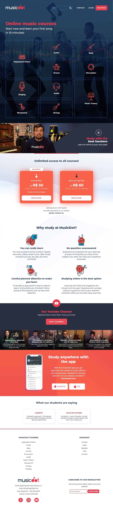

## MusicDot Homepage 
 

Technologies: HTML | CSS

The development of this homepage is part of the program of the Web Development Course: HTML, CSS & JavaScript by Caelum, a brazilian technology school that offers online and in-person courses.

This project was developed based on the course handout and the existing MusicDot homepage.

The homepage is originally in portuguese but for this project it was translated to english.

MusicDot is an online music school. The homepage presents the available courses, the subscription plans, the advantages, and student testimonials. 

Links:

<a href="https://www.caelum.com.br/">Caelum Website</a>

<a href="https://www.caelum.com.br/apostila-html-css-javascript">Course Handout</a>

The homepage is responsive and the layout will automatically adapt to any device screen size, whether it's mobile, tablet, laptop or desktop.

Characteristics of the project:

- Semantic HTML;
- Relative units (% and rem);
- Mobile First;
- Grid;
- Flexbox;
- Media Queries.

 

### Final Result - Mobile version 
 

 
 

### Final Result - Tablet version
 

 
 

### Final Result - Laptop version
 

 
 

### Final Result - Desktop version
 

 
 

***
##### by Juliana Chagas 💜